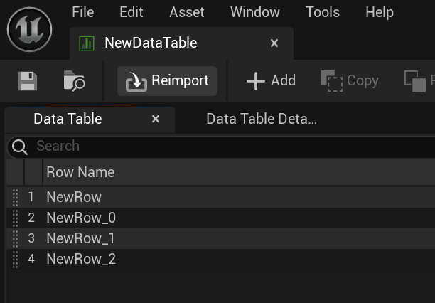
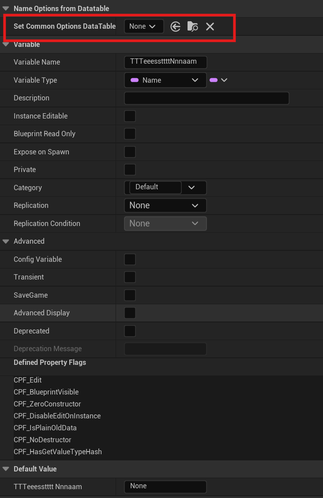
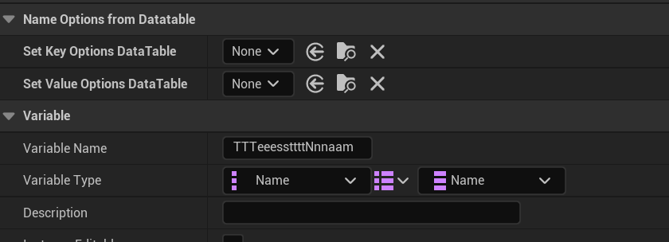

# UE 插件
- 从 DataTable 生成 FName 选择器

## C++使用
1. 复制目标 DataTable 的路径
  <p align = "center">
   
   </p>
2. 给需要生成选择器的 FName 标记 MetaData ：OptionsFromDataTable ,即可使用
   
   ```C++
   UPROPERTY(EditAnywhere,BlueprintReadWrite,meta=(OptionsFromDataTable = "/Game/NewDataTable.NewDataTable"))
	FName TestName;
   ```
<p align = "center">
   
   </p>

   <p align = "center">
   
   </p>

3. 对于 Map 类型需分别对 `Key` 和 `Value` 进行单独设置
   ```C++
   UPROPERTY(EditAnywhere,BlueprintReadWrite,meta=(ValueOptionsFromDataTable = "/Game/NewDataTable.NewDataTable", KeyOptionsFromDataTable = "/Game/NewDataTable.NewDataTable"))
	TMap<FName,FName> TestNameMap;
   ```

## 蓝图使用
在变量面板选择对应 `DataTable` 即可
   <p align = "center">
   
   </p>

   <p align = "center">
   
   </p>

## 其他
- UFUNCTION 引脚选择 DataTable RowName 虚幻原生 MetaData 已经支持，不写了
   ```C++
   UFUNCTION(meta=(DataTablePin="DataTable"))
   void TestFunc(UDataTable* DataTable, FName RowName);
   ```
   RowName 引脚将由 DataTable 引脚所选择的 DataTable 生成