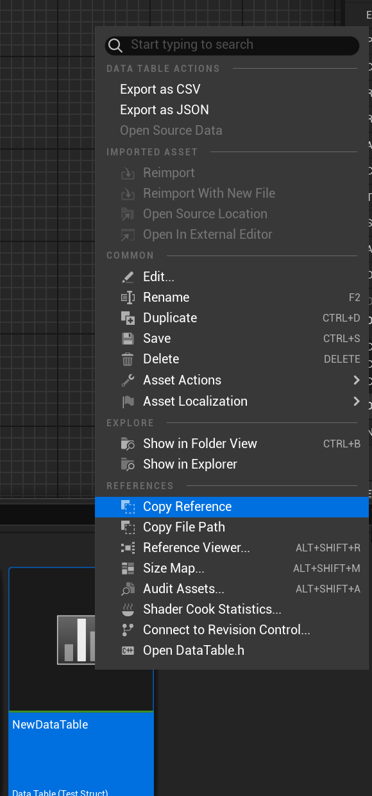
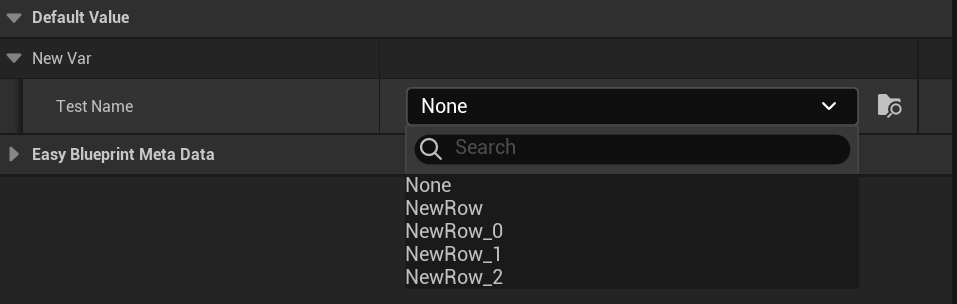

# UE 插件
- 从 DataTable 生成 FName 选择器

## 快速使用
1. 复制目标 DataTable 的路径
  <p align = "center">
   
   </p>
2. 给需要生成选择器的 FName 标记 MetaData ：OptionsFromDataTable ,即可使用
   
   ```
   UPROPERTY(EditAnywhere,BlueprintReadWrite,meta=(OptionsFromDataTable = "/Game/NewDataTable.NewDataTable"))
	FName TestName;
   ```
<p align = "center">
   
   </p>

   <p align = "center">
   
   </p>

## 其他
- UFUNCTION 引脚选择 DataTable RowName 虚幻原生 MetaData 已经支持，不写了
   ```
   UFUNCTION(meta=(DataTablePin="DataTable"))
   void TestFunc(UDataTable* DataTable, FName RowName);
   ```
   RowName 引脚将由 DataTable 引脚所选择的 DataTable 生成